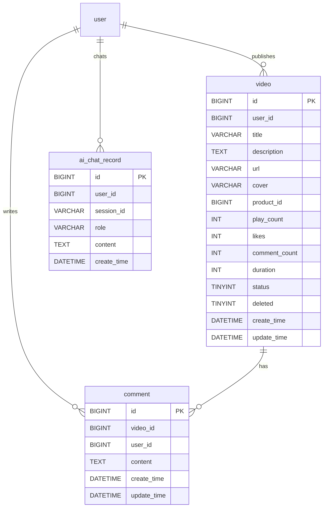
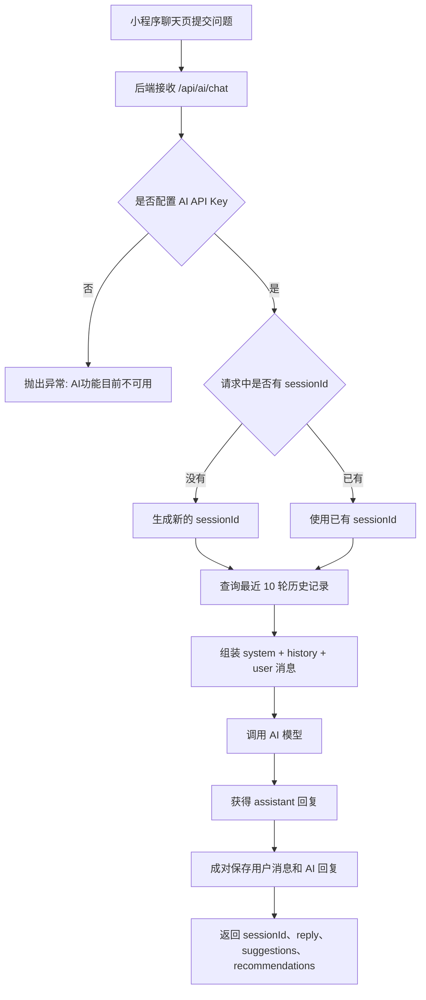
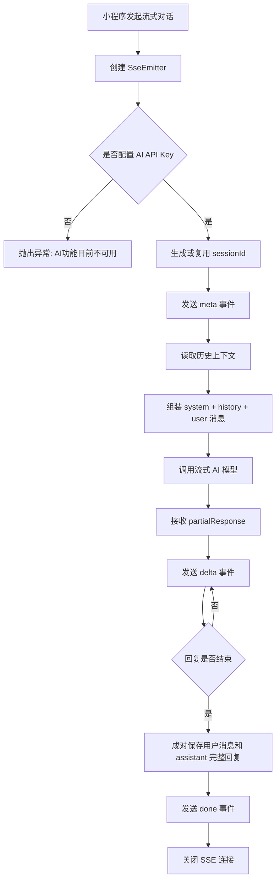
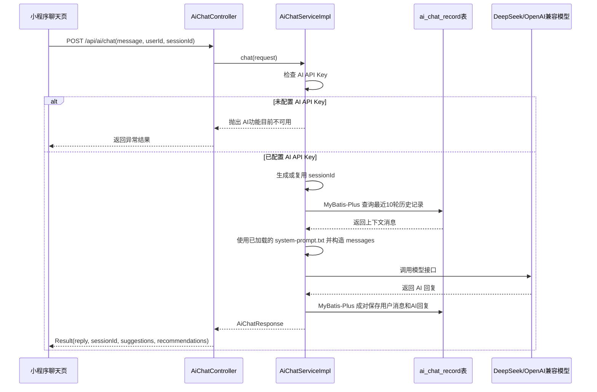
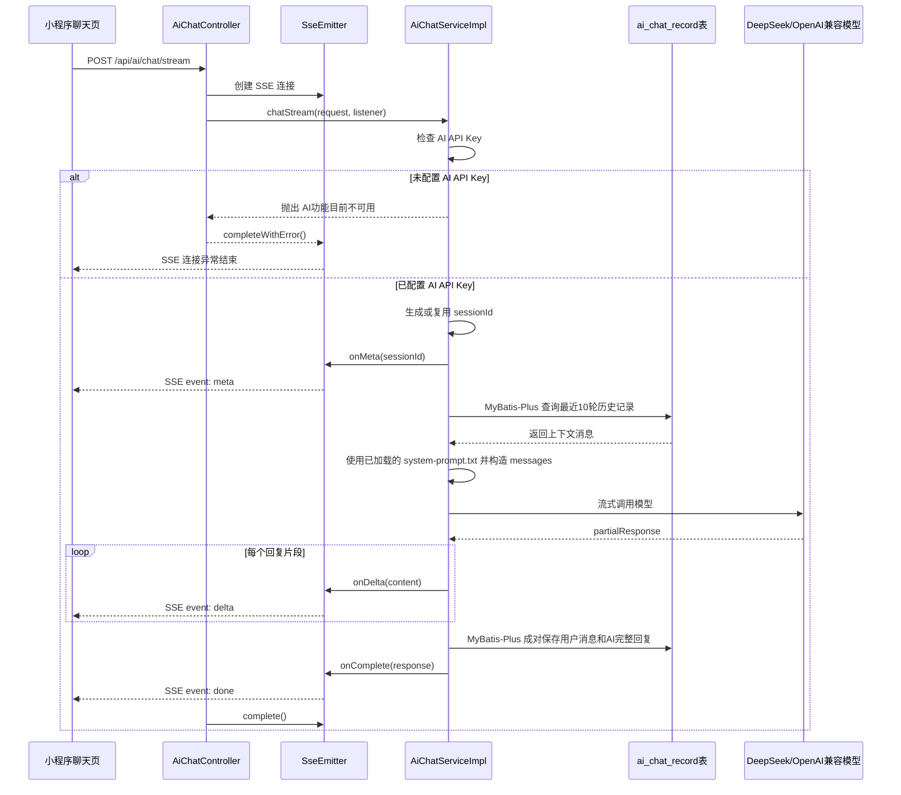
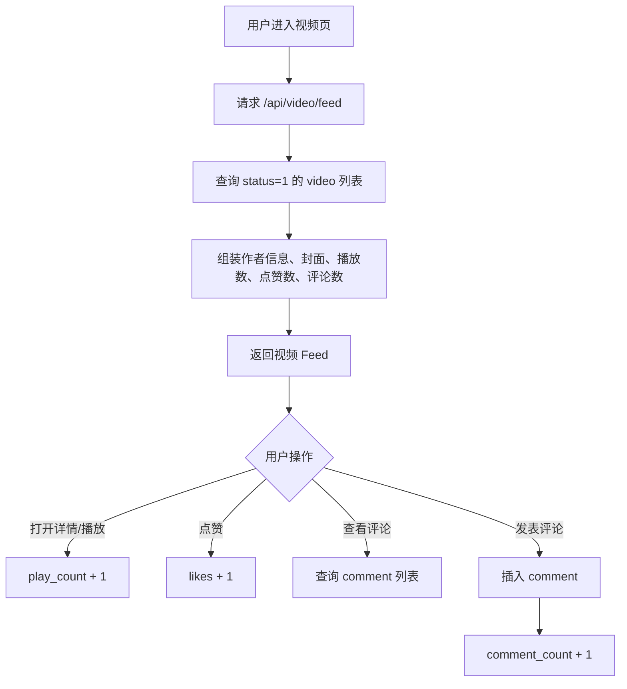
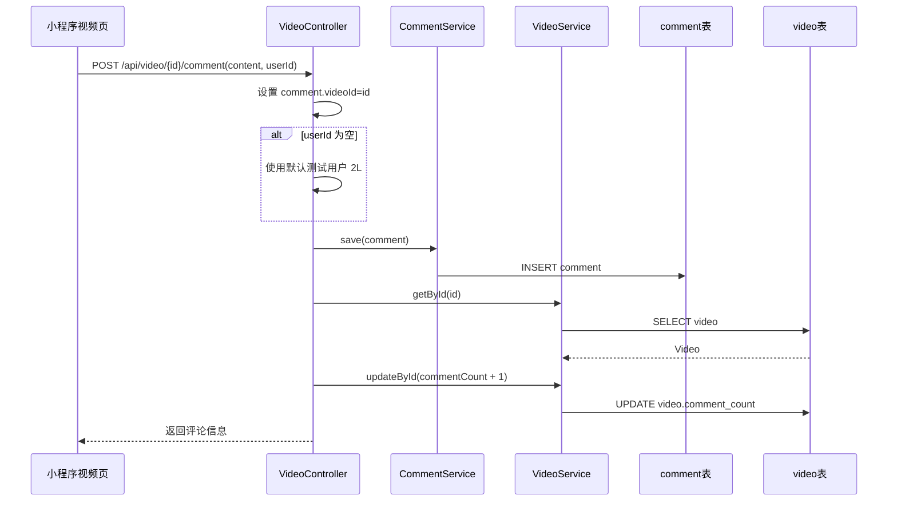

# 人员D：视频与 AI 智能客服相关资料

适用章节：
- `3.2.4 视频与AI相关表（video、comment、ai_chat_record）`
- `4.4 AI 智能客服对话流程：流程图 + 时序图`

资料来源：
- `pet_backend/src/main/resources/doc/pet_store.sql`
- `docker/mysql/init/03_local_demo_patch.sql`
- `pet_backend/src/main/java/com/pat/video/**`
- `pet_backend/src/main/java/com/pat/ai/**`

## 3.2.4 视频与 AI 相关表

本模块只提炼人员D负责的“视频互动 + AI 智能客服”相关表，核心包括 `video`、`comment`、`ai_chat_record` 三张表。其中 `video` 和 `comment` 支撑视频 Feed、播放、点赞、评论等互动功能；`ai_chat_record` 支撑 AI 客服的会话上下文和历史记录。

### 1. video 视频表

表名：`video`

用途：保存视频内容及互动统计信息，支撑小程序视频流、视频详情、播放量统计、点赞统计、评论数量展示，并可通过 `product_id` 与商品建立关联。

| 字段名 | 类型 | 约束/默认值 | 说明 |
|---|---|---|---|
| id | BIGINT | 主键 | 视频 ID，雪花算法生成 |
| user_id | BIGINT | 可为空 | 视频发布用户/作者 ID |
| title | VARCHAR(200) | NOT NULL | 视频标题 |
| description | TEXT/VARCHAR | 可为空 | 视频描述 |
| url | VARCHAR(500) | NOT NULL | 视频播放地址 |
| cover | VARCHAR(500) | 可为空 | 视频封面图 |
| product_id | BIGINT | 可为空，索引 | 关联商品 ID |
| play_count | INT | 默认 0 | 播放次数 |
| likes | INT | 默认 0 | 点赞数 |
| comment_count | INT | 默认 0 | 评论数 |
| duration | INT | 默认 0 | 视频时长，单位秒 |
| status | TINYINT | 默认 1 | 状态：0 下架，1 上架 |
| deleted | TINYINT(1) | 默认 0 | 逻辑删除：0 正常，1 删除 |
| create_time | DATETIME(3) | 默认当前时间 | 创建时间 |
| update_time | DATETIME(3) | 自动更新 | 更新时间 |

主要业务规则：
- 视频 Feed 只查询 `status=1` 的视频。
- 用户进入视频详情或播放接口时，`play_count` 增加 1。
- 用户点赞时，`likes` 增加 1。
- 用户发表评论成功后，`comment_count` 增加 1。
- 后台可对视频执行上架、下架操作，本质是修改 `status`。

主要接口：

| 接口 | 方法 | 作用 |
|---|---|---|
| `/api/video/feed` | GET | 获取视频 Feed 流 |
| `/api/video/list` | GET | 获取视频列表，兼容 Feed 查询 |
| `/api/video/search` | GET | 搜索视频，兼容 Feed 查询 |
| `/api/video/{id}` | GET | 获取视频详情，并增加播放量 |
| `/api/video/play/{id}` | GET | 播放视频，并增加播放量 |
| `/api/video/{id}/like` | POST | 点赞视频 |
| `/api/video/{id}/comments` | GET | 获取视频评论列表 |
| `/api/video/{id}/comment` | POST | 发表评论 |
| `/api/video/upload` | POST | 上传视频文件 |
| `/api/admin/video/{id}/online` | PUT | 后台上架视频 |
| `/api/admin/video/{id}/offline` | PUT | 后台下架视频 |

### 2. comment 视频评论表

表名：`comment`

用途：保存视频评论内容，支撑视频详情页评论区展示和用户评论发布。

| 字段名 | 类型 | 约束/默认值 | 说明 |
|---|---|---|---|
| id | BIGINT | 主键 | 评论 ID，雪花算法生成 |
| video_id | BIGINT | NOT NULL，索引 | 所属视频 ID |
| user_id | BIGINT | 可为空，索引 | 评论用户 ID |
| content | TEXT | NOT NULL | 评论内容 |
| create_time | DATETIME(3) | 默认当前时间 | 创建时间 |
| update_time | DATETIME(3) | 自动更新 | 更新时间 |

主要业务规则：
- 评论必须绑定一个视频，即 `video_id`。
- 评论列表按 `create_time` 倒序展示。
- 发表评论时，如果前端未传 `user_id`，当前代码默认使用测试用户 `2L`。
- 评论保存成功后，会同步更新 `video.comment_count`。

### 3. ai_chat_record AI 对话记录表

表名：`ai_chat_record`

用途：保存 AI 客服的会话记录。每轮对话会保存用户消息和 AI 回复，用于历史记录查询、上下文拼接、会话删除等功能。

| 字段名 | 类型 | 约束/默认值 | 说明 |
|---|---|---|---|
| id | BIGINT | 主键 | 对话记录 ID，雪花算法生成 |
| user_id | BIGINT | 可为空，索引 | 用户 ID，游客可为空 |
| session_id | VARCHAR(64) | NOT NULL，索引 | 会话 ID |
| role | VARCHAR(20) | NOT NULL | 消息角色：`user` 或 `assistant` |
| content | TEXT | NOT NULL | 消息内容 |
| create_time | DATETIME(3) | 默认当前时间 | 创建时间 |

主要业务规则：
- 如果请求没有传 `sessionId`，后端自动生成新的会话 ID。
- 每次 AI 对话会先保存用户消息，再保存 AI 回复。
- 调用 AI 模型前，后端会读取同一 `session_id` 最近 8 条记录作为上下文。
- 支持根据 `session_id` 查询历史记录，也支持删除整个会话。

主要接口：

| 接口 | 方法 | 作用 |
|---|---|---|
| `/api/ai/chat` | POST | AI 同步对话 |
| `/api/ai/chat/stream` | POST | AI SSE 流式对话 |
| `/api/ai/session/{sessionId}` | DELETE | 删除 AI 会话 |
| `/api/ai/record/session/{sessionId}` | GET | 查询某个会话的历史记录 |
| `/api/ai/record/session/{sessionId}` | DELETE | 删除某个会话的历史记录 |

## 表关系说明

三张表的关系如下：

- `video.id` 与 `comment.video_id` 是一对多关系：一个视频可以有多条评论。
- `user.id` 与 `comment.user_id` 是一对多关系：一个用户可以发表多条评论。
- `user.id` 与 `video.user_id` 是一对多关系：一个用户可以发布多个视频。
- `user.id` 与 `ai_chat_record.user_id` 是一对多关系：一个用户可以产生多条 AI 聊天记录。
- `ai_chat_record` 通过 `session_id` 聚合同一次 AI 会话中的多条消息。
- `video` 与 `ai_chat_record` 没有直接外键关系，但都属于人员D负责的“视频内容 + AI 客服”功能范围。

## 4.4 AI 智能客服对话流程

AI 智能客服由小程序聊天页发起请求，后端 `AiChatController` 接收请求，再由 `AiChatServiceImpl` 负责检查 AI API Key、生成会话 ID、读取历史上下文、保存用户消息、调用 AI 模型，并最终保存 AI 回复。如果未配置 AI API Key，后端直接抛出“AI功能目前不可用”，不再生成本地模拟回复。

实现调整：
- 对话记录的查询、保存、删除通过 `IAiChatRecordService` 和 MyBatis-Plus 完成，不在业务代码中直接拼写 JDBC SQL。
- 系统提示词已拆分到 `pet_backend/src/main/resources/ai/system-prompt.txt`，代码只读取提示词文件，并在运行时追加当前宠物档案。
- 系统提示词会作为模型上下文中的第一条 `SystemMessage` 传入；历史记忆轮次通过 `ai.chat.memory-turns` 控制，默认 10 轮，即最多读取最近 20 条 `ai_chat_record` 消息。
- 模型最大输出长度通过 `ai.chat.max-tokens` 控制，默认 2048，可用环境变量 `DEEPSEEK_MAX_TOKENS` 覆盖。

### 4.4.1 AI 客服同步对话流程

对应接口：`POST /api/ai/chat`

处理步骤：

1. 小程序聊天页提交用户问题、用户 ID、会话 ID、宠物档案、模型模式等参数。
2. 后端先检查是否配置 AI API Key。
3. 如果未配置，直接抛出“AI功能目前不可用”。
4. 如果已配置，继续判断是否存在 `sessionId`。
5. 如果没有 `sessionId`，后端生成新的会话 ID。
6. 后端通过 MyBatis-Plus 根据 `sessionId` 查询最近若干轮历史消息作为上下文，默认 10 轮。
7. 后端组装系统提示词、历史上下文和当前用户消息。
8. 后端调用 DeepSeek/OpenAI 兼容接口获取回复，并受 `ai.chat.max-tokens` 限制最大输出长度。
9. 后端将用户消息和 AI 回复成对写入 `ai_chat_record`，避免只保存半轮对话。
10. 后端返回 `sessionId`、AI 回复、追问建议和推荐内容。

### 4.4.2 AI 客服流式对话流程

对应接口：`POST /api/ai/chat/stream`

流式对话使用 SSE。后端会先返回 `meta` 事件告知会话 ID，再不断返回 `delta` 事件输出片段，最后返回 `done` 事件表示回复完成。

## AI 智能客服泳道图

下图采用竖向泳道图形式，角色作为顶部列标题，流程从上往下推进。泳道按业务参与方划分为：用户、小程序、智能客服、系统、AI 模型。其中“系统”整合了提示词文件读取和 `ai_chat_record` 对话记录读写。

## AI 智能客服时序图

### 1. 同步对话时序图

### 2. 流式对话时序图

## 视频互动流程图

虽然 `4.4` 重点是 AI 客服，但人员D还包括视频功能。可在视频模块章节使用下面的流程图。

## 视频互动泳道图

下图采用和 AI 客服一致的竖向泳道图形式，按用户、小程序、视频服务、评论服务、数据库划分职责，用于说明视频 Feed、播放、点赞、评论的协作过程。

## 视频评论时序图

## 可写进文档的简短总结

人员D负责的视频与 AI 智能客服模块主要围绕三张表展开：`video` 表保存视频内容和互动统计，`comment` 表保存用户对视频的评论，`ai_chat_record` 表保存 AI 客服会话消息。视频模块通过播放、点赞、评论等接口提升内容互动能力；AI 客服模块通过会话 ID 维护上下文，将用户消息和 AI 回复分别写入记录表，从而支持连续对话、历史查询和会话清理。

## 注意点

1. `video` 主建表 SQL 中字段较基础，当前代码实体和补丁 SQL 已使用 `user_id`、`description`、`likes`、`comment_count`、`duration` 等字段，写文档时建议按当前代码实际字段说明。
2. `ai_chat_record.user_id` 允许为空，表示游客也可以咨询 AI 客服。
3. AI 客服如果没有配置 API Key，会直接抛出“AI功能目前不可用”，不会生成模拟回复，也不会保存新的对话记录。
4. 当前 AI 客服只做咨询与推荐，不直接修改商品、订单、购物车等业务数据。
5. 系统提示词不再硬编码在 `buildSystemPrompt` 方法中，而是维护在 `resources/ai/system-prompt.txt` 文件里，便于后续由组长或文档负责人统一调整。
